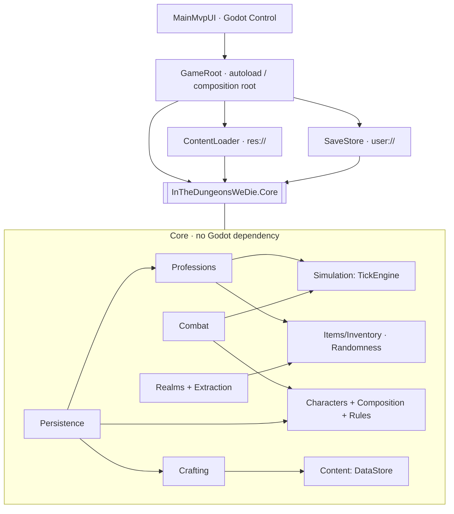
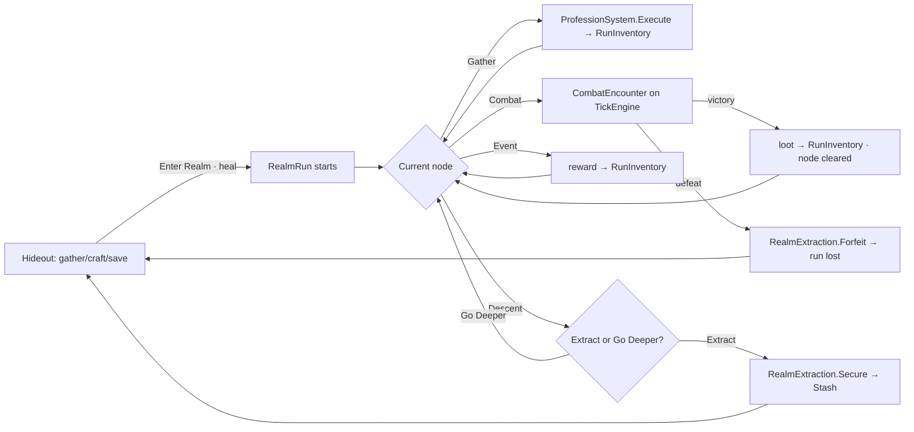

# Current State — Implementation Audit

> **Purpose:** A ground-truth snapshot of what actually exists in the codebase as of the completed MVP vertical slice (milestones 1–9). This document is written from the **code**, not the design docs. Where the design docs (`docs/*.md`) describe something not yet built, it is called out as *planned*, not current.
>
> **Scope note:** "Implemented" means there is working, tested code. "Prototype" means it works but is deliberately shallow. "Stubbed/missing" means it is referenced or designed but not built.
>
> Verified against: 57 Core `.cs` files (~2,900 lines), 4 Godot `.cs` files, 1 scene, 28 test files (**120 passing test cases**), 36 JSON content files. All Core tests pass; the solution builds clean.

---

## 1. Current playable gameplay loop

The full loop is playable through the debug UI and proven by an automated integration test (`tests/Integration/FullLoopTests.cs`):

```
Hideout:
  Train professions (passive auto-gather or active timed attempt) → materials into Stash
  Craft: experiment/brew (Barkbound Iron, Healing Salve) → new items into Stash
  Save / Load persistent progression

Enter the Dark Forest (heals to full on entry):
  Travel between spatial locations (adjacency-gated)
  Gather nodes    → materials into the RUN inventory (unsecured)
  Combat nodes    → tick-driven fight; win clears the node, loot into RUN inventory
  Event node      → one-shot reward into RUN inventory
  The Descent     → choose EXTRACT or GO DEEPER (depth 1 → 2, tougher enemy)
  Extraction node → EXTRACT

Resolve the run:
  Extract → run inventory secured into the Stash, +knowledge, return to Hideout
  Die in combat → run inventory forfeited, Stash safe, return to Hideout

Repeat: better professions / crafted supplies → survive deeper → secure more.
```

**What actually drives it:** a single shared `TickEngine` at 20 ticks/second (only advances while the sim is "running"; starting a passive action or a fight auto-starts it). Combat telegraphs and passive gathering both resolve on that clock.

---

## 2. Every implemented system

| System | Location (namespace) | Status |
|---|---|---|
| Tick simulation / scheduler | `Dungeons.Simulation` (`TickEngine`, `ScheduledAction`) | Implemented |
| Data-driven content store | `Dungeons.Content` (`DataStore<T>`, `IDefinition`) | Implemented |
| Character attributes & resources | `Dungeons.Characters` (`AttributeSet`, `ResourcePool`, `ResourceCalculator`) | Implemented |
| Modifier pipeline | `Dungeons.Characters.Modifiers` | Implemented |
| Character composition (Species+Class+Prefix+Suffix) | `Dungeons.Characters.Composition` | Implemented |
| Code-driven character rules ("rule breakers") | `Dungeons.Characters.Rules` | Prototype (2 live rules) |
| Items & inventory | `Dungeons.Items` (`ItemStack`, `Inventory`) | Implemented |
| Seeded RNG | `Dungeons.Randomness` | Implemented |
| Professions (level/xp/mastery, passive + active) | `Dungeons.Professions` | Implemented |
| Crafting (experiment → discovery) | `Dungeons.Crafting` | Prototype |
| Combat (tick-driven encounter) | `Dungeons.Combat` | Prototype |
| Consumables ("Use Item") | `Dungeons.Combat` (`ConsumableDefinition`) | Prototype (Heal only) |
| Realm exploration (location graph, depth) | `Dungeons.Realms` | Prototype |
| Extraction / run-loss | `Dungeons.Realms` (`RealmExtraction`) | Implemented |
| Save / load (progression persistence) | `Dungeons.Persistence` | Implemented |
| Godot composition root + debug UI | `Dungeons.Game` | Implemented (debug-grade) |

There is **no**: equipment/gear system, loot tables, currency/economy, status effects, positioning, character level, character creation UI, audio, art, or animation.

---

## 3. How the major systems connect

Everything is wired together in **one place**: `game/GameRoot.cs` (an autoloaded Godot `Node`, the composition root). It constructs every Core service in `_Ready()`, subscribes to their events, and exposes an application-facing surface (commands + query strings + C# events) to the UI.

Key linkages (all in `GameRoot`):
- **UI → GameRoot → Core.** `MainMvpUI` calls `GameRoot` methods (`StartPassive`, `CombatAttack`, `RealmTravel`, …) and reads back formatted report strings; it never touches Core systems for authority (it *does* read Core value types like `RealmRun`/definitions for display).
- **Shared clock.** `GameRoot._Process` advances the `TickEngine` at 20/s while running. Both `PassiveProfessionRunner` and `CombatEncounter` schedule onto that same engine.
- **The "current bag".** `GameRoot.CurrentBag` returns the **run inventory** while in a Realm, else the **Stash**. `ProfessionSystem` is constructed with `() => CurrentBag`, so gathering deposits to the right place automatically. Combat loot and event rewards also add to `CurrentBag`.
- **Combat ↔ Realm bridge.** When a fight is started from a Realm combat node, `GameRoot._realmCombatLocationId` remembers where; on `CombatEncounter.Ended`, victory marks the node cleared, defeat ends the run.
- **Events for UI refresh.** `GameRoot` raises `LogEmitted`, `CharacterChanged`, `InventoryChanged`, `RunningChanged`, `DiscoveryChanged`, `CombatChanged`, `RealmChanged`. The UI subscribes and re-renders the relevant panel.

```
MainMvpUI (Godot Control)
   │  method calls (commands) + report-string queries
   ▼
GameRoot (autoload, composition root + application glue)
   │  constructs & owns:
   ├─ TickEngine ───────────────┐ (shared clock)
   ├─ ProfessionSystem ─ uses ──┤
   ├─ PassiveProfessionRunner ──┘
   ├─ CraftingExperimentSystem ─ uses → DiscoverySystem, DataStores, Stash
   ├─ CombatEncounter ─ uses → CombatCalculator, TickEngine, ability DataStore
   ├─ CharacterComposer → Character (+ RuleRegistry)
   ├─ RealmRun (per expedition) + RealmExtraction
   ├─ Inventory (_stash) / RealmRun.RunInventory
   └─ SaveMapper ↔ SaveStore(user://) ↔ SaveSerializer
```

---

## 4. Current architecture and project structure

Two production projects + one test project, tied by a root `.slnx`:

```
/InTheDungeonsWeDie.slnx
/core   → InTheDungeonsWeDie.Core.csproj   (net8.0, RootNamespace "Dungeons", NO Godot reference)
/game   → InTheDungeonsWeDie.csproj         (Godot.NET.Sdk/4.7.1, net8.0, references Core)
          project.godot lives here; Godot project root
/tests  → InTheDungeonsWeDie.Core.Tests.csproj (net8.0, xUnit, references Core only)
/docs   → design docs + this file
```

- **Domain-first is enforced by the assembly boundary**, not just convention: Core has no Godot dependency, so `using Godot` cannot leak into gameplay logic, and tests run with zero Godot.
- **No separate Application/Infrastructure assemblies.** "Application/use-case" orchestration lives in `GameRoot`; Godot-side infrastructure (`ContentLoader`, `SaveStore`) lives in `game/Infrastructure`.
- Core is organized **by gameplay feature**, not by layer. Namespaces: `Dungeons.Simulation`, `.Content`, `.Characters(.Modifiers/.Composition/.Rules)`, `.Items`, `.Inventory`, `.Randomness`, `.Professions`, `.Crafting`, `.Combat`, `.Realms`, `.Persistence`. Godot: `Dungeons.Game(.Infrastructure/.Ui)`.
- Content is data-driven JSON under `game/data/<type>/*.json`, loaded via Godot `FileAccess`/`DirAccess` and fed as text into `DataStore<T>` (Core never sees a file path).
- Toolchain: only .NET 10 SDK is installed; everything targets `net8.0` (Godot 4.7's baseline) and relies on roll-forward. Godot is not on PATH here — the game is verified by `dotnet build`/`dotnet test`; the actual window runs from the user's Godot editor.

---

## 5. Important classes and responsibilities

**Simulation**
- `TickEngine` — deterministic clock. `CurrentTick`, `Schedule(delayTicks, callback)`, `Advance(ticks)`, `Cancel(id)`, `TickAdvanced` event. Resolves same-tick actions in stable schedule order; snapshots due actions before firing (so callbacks can cancel *future* actions safely).
- `ScheduledAction` — id + resolve tick + sequence + callback.

**Content**
- `DataStore<T> where T : IDefinition` — in-memory registry. `LoadOne`/`LoadMany`/`Reload`/`GetById`/`TryGetById`/`GetAll`/`Contains`. Fails loudly on duplicate ids (`DuplicateDefinitionException`). **Path-agnostic** (consumes JSON text). Enum-from-string + case-insensitive parsing configured here.
- `IDefinition` — `string Id`. `MaterialDefinition` — `Id/Name/Tags/Properties` + `GetProperty/HasProperty`.

**Characters**
- `AttributeSet` — immutable 7-attribute value type (STR/DEX/INT/CON/WIS/END/LCK) with indexer/`With`/`Add`/`Plus`.
- `ResourcePool` — current/max with clamping, `Reduce`/`Restore`/`Fill`, `Fraction`; **never auto-regenerates**.
- `ResourceCalculator` — derives maxima: `MaxHealth = 20 + CON*6 + END*3`, `MaxStamina = 20 + END*5 + DEX*2`, `MaxMana = 10 + INT*5 + WIS*3`.
- `ModifierPipeline` — `(base + Σ adds) × Π multiplies`, clamped. `StatId` (7 attributes + MaxHealth/MaxMana/MaxStamina), `ModifierOperation` (Add/Multiply).
- `CharacterComposer` — resolves a `CharacterBuild` (4 ids) + baseline into a `CharacterBlueprint`. Applies modifiers across all four components, derives resources, aggregates tags/abilities, resolves rule ids via `RuleRegistry` (unknown id → throw), builds the display name.
- `Character` — runtime: blueprint + `ResourcePool` Health/Mana/Stamina. `EffectiveAttributes` = base + active rule bonuses (recomputed from a live `CharacterSnapshot`). `TakeDamage`/`Heal`/`RestoreAll`.
- `ICharacterRule` + `RuleRegistry` — code-driven hooks keyed by rule id. Two implementations (health-conditional attribute bonuses).

**Professions**
- `ProfessionSystem` — single `Execute(actionId, performance, isActive)` path used by both passive and active. Validates level + inputs, consumes inputs / produces outputs into the provider-supplied `Inventory`, grants xp + mastery, raises `ActionCompleted`/`LeveledUp`. `AllProgress`/`RestoreProgress` for save/load.
- `ActionResolver` — pure outcome resolution (guaranteed outputs + rolled bonus outputs + xp), scaled by mastery and active performance.
- `PassiveProfessionRunner` — one action at a time on the `TickEngine`; reschedules each interval; stalls (event) when inputs run out.
- `ProfessionProgress` — xp → level, per-action mastery. `ProfessionLeveling` (cumulative `100·(L-1)·L/2`, cap 99), `ProfessionTuning` (interval reduction, bonus chance, active bonuses).

**Crafting**
- `CraftingExperimentSystem` — matches submitted material ids to a `CraftingInteractionDefinition`, gates on profession level, consumes inputs, produces the result, records the discovery. Same call both discovers and re-crafts.
- `DiscoverySystem` — set of discovered ids; `Record` (event, once), `Restore` (silent, for load).

**Combat**
- `CombatEncounter` — the authoritative tick-driven fight. Enemies run a self-scheduling `decide → telegraph → execute → recovery` loop. Player commands: `Attack`, `Block`, `Dodge`, `Wait`, `UseHealingItem`. Exposes `Intents` (enemy telegraphs with execute ticks), `Combatants`, `PlayerReady`. Events: `Logged`, `StateChanged`, `Ended`.
- `CombatCalculator` — damage pipeline: base + STR/INT scaling → crit → CON armor → block(×0.4)/dodge(negate). Deterministic via injected RNG.
- `Combatant` — wraps the player `Character` (shares its real Health pool; reads *effective* attributes) or an enemy `ActorDefinition`. Timed block/dodge stances (`BlockUntilTick`/`DodgeUntilTick`, default −1).
- `CombatTuning` — all combat constants in one place.

**Realms**
- `RealmRun` — the expedition aggregate: realm, tier, current depth, current location, visited/cleared sets, and the **run inventory**. Adjacency-validated `TravelTo`, `Descend` (depth 1→2), `CanExtract`, `End`.
- `RealmExtraction` — `Secure(run, stash)` (move run loot → stash, end run) / `Forfeit(run)` (lose it, end run).
- `RealmDefinition` / `RealmLocationDefinition` — the location graph.

**Persistence**
- `SaveData` (schema v2), `SaveSerializer` (System.Text.Json, string/stream), `SaveMapper` (Capture/Apply between live systems and `SaveData`). Godot-side `SaveStore` owns `user://save.json`.

---

## 6. Current data models and JSON definitions

All content lives in `game/data/<type>/`. **36 files total.** Loaded per-type into `DataStore<T>` at startup.

| Folder | Core type | Key fields | Count |
|---|---|---|---|
| `species/` | `SpeciesDefinition : CharacterComponentDefinition` | Id, Name, Tags[], Modifiers[], AbilityIds[], RuleIds[] | 3 |
| `classes/` | `BaseClassDefinition` | …above + `PrimaryResource` (Health/Mana/Stamina) | 2 |
| `prefixes/` | `PrefixDefinition` | as component | 3 |
| `suffixes/` | `SuffixDefinition` | as component | 5 |
| `professions/` | `ProfessionDefinition` | Id, Name, Category (Gathering/Crafting/Utility), PrimaryAttributes[] | 3 |
| `profession_actions/` | `ProfessionActionDefinition` | Id, ProfessionId, Name, RequiredLevel, BaseIntervalTicks, Experience, Inputs[], Outputs[], BonusOutputs[] | 3 |
| `materials/` | `MaterialDefinition` | Id, Name, Tags[], Properties[] ({property, value}) | 8 |
| `crafting_interactions/` | `CraftingInteractionDefinition` | Id, Name, Inputs[] (ItemStack), ProfessionRequirements[], ResultItemId, ResultQuantity, DiscoveryId | 2 |
| `abilities/` | `AbilityDefinition` | Id, Name, DamageType, BaseValue, StaminaCost, Timing{telegraph,windup,recovery} | 3 |
| `actors/` | `ActorDefinition` | Id, Name, Attributes (AttributeSet), Resources{h,m,s}, AbilityIds[], LootItemId? | 2 |
| `consumables/` | `ConsumableDefinition` | Id, Name, HealAmount | 1 |
| `realms/` | `RealmDefinition` | Id, Name, SupportedTiers[], Tags[], Locations[] | 1 |

`RealmLocationDefinition` (nested): Id, Name, Type (Entrance/Travel/Combat/Gather/Event/Descent/Extraction), Depth, Connections[], ActorId?, ProfessionActionId?, EventText?, RewardItemId?, RewardQuantity.

`Modifier` JSON shape: `{ "stat": "Strength", "op": "Add", "value": 2 }` (stat = any `StatId`).

**Model inconsistency to note:** item+quantity appears in two shapes — `ItemStack` (`{itemId, quantity}`, used by crafting inputs & stash) and `ItemAmountData`/`ItemChanceData` (used by profession action inputs/outputs). Both deserialize fine but it's duplication worth unifying.

**Content currently shipped:**
- Species: Human, Undead, Fey-Touched. Classes: Bastion (Stamina), Hexslinger (Mana). Prefixes: Ironbound, Frenzied, Pyromaniac. Suffixes: Unreasonable Confidence, Inappropriate Optimism, Exploding Kneecaps, The Bigger Hammer, The Last Laugh.
- Professions: Forestry (chop_oak), Herblore (gather_sageleaf), Smithing (smelt_iron).
- Materials: oak_log, oak_bark, sageleaf, marsh_root, iron_ore, iron_ingot, barkbound_iron, goblin_scrap.
- Recipes: Barkbound Iron (iron_ingot + oak_bark, Herblore L2), Healing Salve (2 sageleaf, Herblore L1).
- Abilities: strike (player), goblin_slash, goblin_smash. Actors: Goblin Raider, Goblin Brute. Consumable: Healing Salve (heal 25).
- Realm: The Dark Forest — 10 locations across 2 depths.

---

## 7. Current Godot scenes / UI / screens

- **One scene:** `game/ui/MainMvpUI.tscn` — a single root `Control` with the `MainMvpUI.cs` script; it's the main scene. Everything else is built **in code** in `MainMvpUI._Ready()`.
- **One autoload:** `GameRoot` (`res://GameRoot.cs`).
- **`MainMvpUI`** is a scrolling single-page "debug shell" (not production screens). Sections, all in one vertical list:
  - Top bar: tick + sim state; **Play/Pause**, **Advance 50 Ticks**, **Save**, **Load**.
  - **Character**: identity, effective/base attributes, resources, tags, active rules; buttons **Damage 40% / Heal Full / Cycle Suffix**.
  - **Professions**: level summary, an **active-timing sweep bar**, per-action **Passive**/**Active** buttons, a **passive progress bar**, **Stop Passive**.
  - **Crafting**: known/undiscovered recipe list; **Experiment: Iron+Bark**, **Brew Healing Salve**, **Grant Craft Test Mats** (debug).
  - **Realm**: HUD (realm/tier/depth/location/HP/knowledge/unsecured-loot) + dynamically rebuilt controls — Enter buttons in the Hideout; travel/action/Go-Deeper/Extract in a run; **Attack/Block/Dodge/Use Salve** while a fight is active.
  - **Combat**: enemy telegraph countdown + HP/STA; sandbox **Fight Goblin Raider/Brute** + **Attack/Block/Dodge/Use Salve/Wait**.
  - **Event log**: `RichTextLabel` of everything `GameRoot` emits.
- Update strategy: mostly event-driven refresh; `_Process` polls only animating values (tick label, timing bar, passive bar, live combat countdown). Realm controls are rebuilt (`QueueFree` + re-add) on `RealmChanged`.

There are **no** production screens (Hideout/Portal/Character sheets as separate scenes), no navigation/tabs, no art, no reusable Control components — it's intentionally one debug page.

---

## 8. Current character / class implementation

- Identity = **Species + Prefix + Base Class + Suffix**, resolved by `CharacterComposer` into a `CharacterBlueprint` (base attributes, max resources, primary resource, tags, ability ids, resolved rules), then a runtime `Character`.
- **Attributes** come from a flat baseline (`AttributeSet.Uniform(5)`, hardcoded in `GameRoot`) modified by the four components. **No character level, no XP, no attribute growth.**
- **The player's build is hardcoded** in `GameRoot`: `species.fey_touched / class.hexslinger / prefix.frenzied` + a **cycling suffix** (debug button). There is **no character creation or selection UI**. The build is saved/loaded.
- **Rule system is real but shallow:** only two suffixes have live `ICharacterRule` code, both health-conditional attribute bonuses (Unreasonable Confidence at ≥90% HP, Inappropriate Optimism at ≤34% HP). These *do* affect combat because `Combatant` reads effective attributes. The other three suffixes and all prefixes are **tags + numeric modifiers only** — their "rule-breaking" combat behavior is not implemented.
- **Class abilities are dead ids.** `class.bastion` lists `ability.guard`, `class.hexslinger` lists `ability.hex_bolt`, but no such abilities exist and combat always uses `ability.strike`. `PrimaryResource` differs by class but **Mana is never consumed** (no spells).

---

## 9. Current professions implementation

- Three professions, all fully working through one framework: **Forestry** & **Herblore** (gathering, no inputs) and **Smithing** (processing: iron_ore → iron_ingot).
- **Passive**: `PassiveProfessionRunner` runs one action on the tick clock, producing every effective interval; stalls when inputs run out. Only advances while the sim is running.
- **Active**: an `Execute(performance>0, isActive:true)` — the UI's oscillating timing bar supplies a 0–1 performance score; higher timing = more bonus-output chance + up to +50% xp. This is the only "active minigame" and it's shared for all gather actions.
- **Progression**: xp → level (cap 99), plus **per-action mastery** that reduces the effective interval (up to −50%) and raises bonus-output chance (up to +25%). All persisted.
- **Bonus outputs**: chance-rolled via seeded RNG (e.g., oak_bark 25% from chopping).
- Smithing starts with 10 seeded iron ore (there is **no Mining profession**, so ore has no in-game source yet).
- **No offline progress** — passive only runs while the app is open and the sim is running.

---

## 10. Current crafting implementation

- Crafting = **experiment/discovery**, not a recipe menu. `CraftingExperimentSystem.Experiment(itemIds)` finds an interaction whose full input set was submitted, gates on profession level, consumes inputs, produces the result item, and records the discovery (first time = "new discovery"; later = plain re-craft).
- Two recipes shipped: **Barkbound Iron** (the flagship cross-profession discovery: iron_ingot + oak_bark, gated Herblore L2) and **Healing Salve** (2 sageleaf, Herblore L1).
- **Material properties exist but are almost inert.** `MaterialDefinition.Properties` (e.g., oak_bark & barkbound_iron carry `toxin_resistance 0.05`) are displayed in logs but **nothing consumes them** — Barkbound Iron does nothing because there is no equipment. Only the consumable's `HealAmount` has a runtime effect.
- **No** crafting quality, infusion, masterwork, active crafting minigame, or experiment-failure byproducts. Result material properties are **static** (baked into the result definition), not dynamically derived from inputs.
- UI exposes two hardcoded craft buttons; the general system supports any data-driven interaction, but there's no generic "pick materials to experiment" UI.

---

## 11. Current combat implementation

- **Tick-driven, single-enemy, single-position.** `CombatEncounter` runs on the shared `TickEngine`. Enemies self-schedule `decide → telegraph → execute → recovery`; the player issues commands that resolve on the same clock.
- **Player actions:** Attack (basic `ability.strike`), Block (timed stance, ×0.4 damage), Dodge (timed stance, negates), Wait, Use Item (heal, costs attack tempo). **Block/Dodge must be timed near the incoming attack's execute tick** — the core skill test.
- **Damage pipeline** (`CombatCalculator`): base + STR·0.5 (physical) / INT·0.5 (magic) → crit (LCK·1% chance, ×1.5) → CON·0.3 flat armor (physical only) → block/dodge. Min 1 damage.
- **Attrition:** the player `Combatant` shares the real `Character` Health pool, so damage persists across fights within a session; entering a Realm heals to full.
- **Enemies:** Goblin Raider (fast, ~0.8s telegraph) and Goblin Brute (slow, ~2.4s "Overhead Smash" — the readable danger moment). Each has exactly one ability; AI just picks it.
- **Not implemented:** positioning/movement, multiple simultaneous enemies (the encounter supports a list, but content/UI use one), status effects, interrupts, parry/evasion, class abilities, mana spells, threat/targeting AI, auto/passive combat, and any suffix *combat* rule-hooks (e.g., Exploding Kneecaps).
- Combat events are surfaced as **log strings** + a `StateChanged` refresh + queryable `Intents`; there are no typed per-hit events (`DamageDealt`, etc.) for richer UI feedback yet.

---

## 12. Current realm / exploration implementation

- **One realm, one fixed authored map** (`dark_forest.json`, 10 nodes), **two depths**, **tier always 1**.
- `RealmRun` owns run state; travel is **adjacency-validated within a depth**; crossing to depth 2 happens only via a **Descent** node's `Descend()`. Depth 2 has the tougher Brute + a better gather.
- **Location types in use:** Entrance, Travel, Gather, Combat, Event, Descent, Extraction. (`Camp`, `Shrine`, `Merchant`, `Elite`, `Boss`, `Hidden`, `Hazard` from the docs are **not** modeled.)
- **Events** are one-shot fixed rewards (the Ruins give iron ore). No branching, no skill checks.
- **Realm Knowledge** is a single integer per realm (increments on enter/discover/clear/extract). It is **purely a score** — it unlocks **no information or options** (contrary to the design intent of "knowledge reveals enemy info / routes / hazards").
- **Not implemented:** realm affixes, tiers >1, procedural generation, campsites, hazards, bosses/elites, hidden/merchant locations, the "prepare loadout" step (no equipment/consumable loadout selection before entering — you just enter).

---

## 13. Current loot / extraction implementation

- **Loot sources:** enemy defeat drops a single guaranteed `LootItemId` (goblins → goblin_scrap); gather nodes produce profession outputs; the event node gives a fixed reward. **No loot tables, no rarity, no weighted drops, no coins/currency, no equipment drops.**
- **Two inventories:** the persistent **Stash** (Hideout) and the per-run **RunInventory** (unsecured). Realm loot flows into the run inventory automatically via `CurrentBag`.
- **Extraction** (`RealmExtraction.Secure`): moves the entire run inventory into the Stash, ends the run, +3 knowledge.
- **Death** (`RealmExtraction.Forfeit`): the run inventory is lost; the Stash is untouched.
- **Gear loss and the starter loadout (design §19) are not implemented** — there is no equipment, so the only real loss is unsecured materials/loot. Item loss is quantity-based (no item instances).

---

## 14. Current progression / save implementation

- **Persistent progression tracks:** profession xp + per-action mastery, realm knowledge (per realm), crafting discoveries, the character build, and the Stash. That's it.
- **Not persistent / not modeled:** character level (doesn't exist), unlocks, equipment, active realm run (you cannot save mid-run — Load is blocked while in a realm), character current HP/resources (recomputed to full on rebuild), and the tick counter (SavedAtTick is stored but not restored to the engine).
- **Save format:** single slot `user://save.json`, schema v2, System.Text.Json. `SaveMapper.Capture/Apply` is engine-independent and round-trip tested. **No migration logic** (a v1 save would load with empty new fields).
- **RNG is not persisted** — the two `SeededRandom` seeds are fixed constants, so a session is reproducible from launch but save/load does not preserve RNG position.

---

## 15. What is fully implemented (solid, tested)

- `TickEngine` scheduling (ordering, simultaneity, cancellation, from-callback cancel).
- `DataStore<T>` load/lookup/duplicate-id validation + enum/case-insensitive JSON parsing.
- Attribute/resource math, `ResourceCalculator`, `ResourcePool` clamping.
- Modifier pipeline (add→multiply→clamp) and `CharacterComposer` resolution + loud failure on unknown ids.
- `Inventory` atomic transactions.
- Profession level/xp/mastery, `ActionResolver`, `ProfessionSystem.Execute`, `PassiveProfessionRunner` (incl. input-starvation stall).
- `CombatCalculator` pipeline and `CombatEncounter` lifecycle (telegraph→execute→recovery, block/dodge timing, victory/defeat, AI loop, use-item).
- `RealmRun` travel/depth/clear rules and `RealmExtraction` secure/forfeit.
- `SaveData`/`SaveSerializer`/`SaveMapper` round-trip.
- The full domain loop composed end-to-end (`FullLoopTests`).

## 16. What is simplified / prototype-level

- **Character rules:** only 2 live rules; all "rule-breaker" combat mechanics deferred.
- **Combat:** single enemy, single position, no status/interrupt/positioning; one player attack ability; Mana unused.
- **Crafting:** discovery + consume/produce only; no quality/infusion/active/failure/dynamic properties.
- **Realm:** one fixed map, tier 1, knowledge is a bare score, events are one-shot rewards, no affixes/camps/hazards/bosses.
- **Loot:** single guaranteed drop per enemy; no tables/rarity/currency.
- **Active gathering:** one generic timing bar; **active crafting/combat not built**.
- **UI:** one debug page, built in code, no production screens/art/audio.
- **Character selection:** hardcoded build + suffix cycler.

## 17. What is stubbed or missing

- **Equipment / gear** (and therefore: item instances, dynamic material properties, gear loss on death, starter loadout, "prepare loadout" step).
- **Loot tables, rarity, currency/economy, vendors.**
- **Status effects, interrupts, positioning, multi-enemy, class abilities, mana spells, auto-combat.**
- **Character level, unlocks, account-level progression.**
- **Mining** (ore has no in-game source), and every profession beyond the three (Fishing, Farming, Alchemy, Cooking, Enchanting, Fletching, Tailoring, Medicine, Beast Lore, Sleight of Hand, Agility, Campcraft, Wayfinding, Devotion, Summoning).
- **Realm affixes, tiers >1, additional realms, procedural generation, campsites, bosses/elites, hidden/merchant/hazard locations.**
- **Offline progress, save migration, multi-slot saves, mid-run save.**
- **Referenced-but-absent content:** `ability.guard`, `ability.hex_bolt` (dead ability ids on the two classes).
- **Multiplayer, audio, art, animation** (out of MVP scope by design).

---

## 18. Existing extension points for adding content

Adding **content of an existing type is data-only** (drop a JSON in the right folder; `GameRoot._Ready` auto-loads the whole folder via `ContentLoader.LoadDefinitions<T>`):

- **New material** → `materials/*.json`.
- **New profession + actions** → `professions/*.json` + `profession_actions/*.json` (works with passive/active, mastery, leveling automatically).
- **New recipe/discovery** → `crafting_interactions/*.json` (inputs/result must reference existing items/professions).
- **New enemy** → `actors/*.json` (+ `abilities/*.json`, + a loot `materials/*.json`); attach via a realm location's `actorId`.
- **New ability** → `abilities/*.json` (only single-target damage + telegraph/windup/recovery is honored today).
- **New realm** → `realms/*.json` (location graph). The Hideout auto-lists every realm's Enter button.
- **New consumable** → `consumables/*.json` (but only `Heal` has an effect, and the "Use Salve" button is hardcoded to `item.healing_salve` — surfacing others needs a small UI change; `UsableConsumables` already enumerates them).

Requires **code** (a new `IDefinition` + `DataStore` field + a `GameRoot` load line, and often wiring/UI):

- A **new definition type** (e.g., ArmorData, LootTableData, StatusEffectData).
- A **new character rule** (implement `ICharacterRule`, register it in the `RuleRegistry` in `GameRoot._Ready`, then reference its `ruleId` from a component JSON).
- A **new consumable/ability effect type** beyond Heal/Damage.
- A **new species/class/prefix/suffix** is data-only to *define*, but to actually *play* one you must change the hardcoded `_build` or add a selection UI.

The cleanest seams for the next phase: `IDefinition`/`DataStore<T>` (content), `ICharacterRule`/`RuleRegistry` (build behavior), `CombatEncounter` command surface (new combat actions/effects), the profession `Execute` path (new activity types), and the `CraftingInteractionDefinition` shape (recipes).

---

## 19. Known limitations and technical debt

- **`GameRoot` is a ~790-line composition-root + application layer + presenter.** It currently orchestrates every system, formats every report string, and owns run/combat state — it is trending toward the "GameGodObject" the docs warn against. Before adding systems, an **Application layer** (use-case services) should be extracted, or `GameRoot` will become a bottleneck.
- **Runtime content validation is missing.** Cross-reference checks (an actor pointing at a real ability, a recipe at a real material) live **only in tests**, not at load time. A bad JSON ships and only throws later via `GetById`. `DataStore.LoadOne` catches duplicate ids but not dangling references.
- **Two item+quantity shapes** (`ItemStack` vs `ItemAmountData`/`ItemChanceData`) — duplication to unify.
- **Dead ability ids** on classes (`ability.guard`, `ability.hex_bolt`).
- **Inert material properties** — the property system exists with no consumer.
- **No character creation** — single hardcoded build.
- **UI is one code-built debug page** with `QueueFree`/re-add churn for realm controls; not a foundation for production screens.
- **RNG/tick not persisted**; save/load resets the clock and RNG position.
- **Mana is defined but never used**; primary-resource-by-class has no gameplay effect yet.
- **No headless test of the Godot layer** — `GameRoot` orchestration and all UI are only verified by hand.
- **Save is single-slot, no migration, no mid-run save.**
- Godot SDK is pinned to `4.7.1` (editor-bumped) while only the .NET 10 SDK is installed locally (relies on net8.0 roll-forward).

---

## 20. Test coverage — what is currently verified

**120 passing test cases across 24 test classes** (Core only — no Godot/UI tests). Highlights:

| Area | Cases | What's verified |
|---|---|---|
| TickEngine | 10 | ordering, simultaneity, cancellation (incl. from callback), advance guards |
| DataStore | 8 | load/lookup, duplicate-id failure, reload, array vs single |
| Attributes/Resources | 7 | set math, resource formulas, pool clamping |
| Modifier pipeline | 4 | add-then-multiply order, clamp, cross-stat isolation |
| Composer + rules | 6 + 3 | resolution, unknown-id/rule failure, live rule-breakers flip on damage/heal |
| Inventory | 5 | atomic add/remove, aggregate needs |
| Profession leveling/system/passive/resolver | 6+7+4+4 | curve, execute (consume/produce/xp/level/failure), passive tick + stall, RNG-driven bonus/active |
| Crafting | 7 | success, discover-once, profession gate, missing inputs, no-match, JSON round-trip |
| Combat calculator/encounter | 5+8 | pipeline (crit/armor/block/dodge/magic), telegraph timing, block/dodge-at-impact, victory/defeat, tempo/recovery, AI loop, use-item |
| Realm run/extraction | 8+3 | travel/depth/descend/extract rules, secure/forfeit |
| Save serializer/mapper | 4+2 | full round-trip, capture→apply to fresh systems |
| **Full-loop integration** | 1 | enter → gather → fight + heal → loot → extract → stash + xp persisted |
| **Content validation** | 2+2+3+2 | characters/professions/combat/realm content cross-references resolve & compose |

**Not covered by tests:** `GameRoot` (all orchestration/wiring), `MainMvpUI` (all UI), `ContentLoader`/`SaveStore` (Godot file IO). These are exercised only by manual play.

---

## 21. Differences between the design docs and the actual implementation

The docs describe a fuller game; the code is a deliberately minimal slice. Key deltas the design docs do **not** yet reflect:

1. **Project layout.** `architecture.md §7` sketches one `Game/` tree with `Domain/Application/Infrastructure/Godot` folders. Actual: **two projects** (`/core` + `/game`) + `/tests`, no separate Application/Infrastructure assemblies, feature-organized namespaces, Godot project relocated to `/game`.
2. **DataStore role.** Docs say `DataStore` loads/validates files. Actual: `DataStore` is **path-agnostic** (Godot `ContentLoader` does file IO); cross-reference validation lives in **tests**, not at load.
3. **Character identity.** Docs want each of Species/Class/Prefix/Suffix to add meaningful mechanics and suffixes to be true rule-breakers. Actual: numeric modifiers + tags + **only 2 live suffix rules**; prefixes are stat/tag only; class abilities are dead ids; Mana unused.
4. **Combat.** `combat-spec.md` specifies a full `QUEUE→TELEGRAPH→WINDUP→EXECUTION→RECOVERY→READY` lifecycle, positioning grid, status effects, interrupts, parry/evasion, auto-combat. Actual: **telegraph→execute→recovery + block/dodge/heal**, single enemy, no positioning/status/interrupts, one player ability.
5. **Crafting.** Docs want quality, infusion, masterwork, active crafting, experiment-failure byproducts, dynamic material interactions. Actual: **deterministic match→consume→produce→discover**; static (baked) result properties; none of the above depth.
6. **Realm.** Docs want For-The-King-2 spatial exploration with affixes, tiers, camps, hazards, bosses, and knowledge that unlocks information. Actual: **one fixed 10-node map, 2 depths, tier 1**; knowledge is a bare score; events are one-shot rewards.
7. **Loot/economy.** Docs reference `LootTableData`, rarity, currency. Actual: **single guaranteed drop**, no tables/rarity/currency.
8. **Progression.** Docs describe multiple tracks including a character level and class unlocks. Actual: **profession xp/mastery + realm knowledge + discoveries + stash**; no character level, no unlocks.
9. **Extraction/death.** Docs include equipped-gear loss and a starter loadout. Actual: only **unsecured run loot** is lost (no equipment exists).
10. **Persistence.** Docs list characters, equipment, active realm run, settings. Actual: **build + stash + professions + knowledge + discoveries**, single slot, no mid-run save, no migration.

`itemization.md` is a stray file (it currently contains a copy of `CLAUDE.md`, not itemization content).

---

## 22. High-level dependency / system-flow diagram

**Dependency direction (compile-time):**



**Runtime gameplay flow (one loop):**



---

## 23. Major design decisions to make next

These are the real forks that shape the next phase. Each is currently *unanswered by the code*:

1. **Equipment system** — the biggest unlock. Decide the model: definitions vs **item instances** (per-item durability/affixes/quality), how **material properties feed crafted gear**, equipment slots, stat contribution, and the **gear-loss-on-death** rule + starter loadout. This is the prerequisite for making crafting (and Barkbound Iron) matter.
2. **Loot & economy** — introduce `LootTableData`, rarity tiers, and whether there's **currency/vendors**, or a pure materials-and-gear economy. Defines what combat/realms actually reward.
3. **Combat depth** — pick what to add first: **class abilities + Mana spells**, **status effects**, **multiple enemies / targeting**, **positioning**, **interrupts**. Also decide how **suffix combat rule-hooks** plug into `CombatEncounter` (the rule system exists for character stats; combat needs its own hook surface).
4. **Character model** — is there a **character level**? How do species/class/prefix/suffix scale and unlock? Add a **character creation/selection UI** (the build is currently hardcoded). Decide the **roster** you actually want to ship.
5. **Crafting depth** — commit to **quality tiers**, **infusion**, **masterwork**, **active crafting minigames**, and **dynamic material-property derivation** (vs today's static baked properties). Decide whether recipes are discovered, taught, or listed.
6. **Realm/content model** — **authored vs procedural** maps; introduce **affixes**, **tiers**, **more location types** (camp/boss/elite/hidden/merchant/hazard), and make **Realm Knowledge unlock information/options** instead of being a score. Decide the "**prepare loadout**" pre-run step.
7. **Progression architecture** — which tracks are **character-scoped vs account-scoped**; how unlocks gate content; whether **offline progress** exists (and its aggregate-simulation model).
8. **Content pipeline & validation** — add **runtime cross-reference validation** at load (currently tests-only), decide on authoring tooling, and unify the two item+quantity shapes.
9. **Save model** — **multi-slot**, **mid-run save/resume** (persist the active `RealmRun`), RNG/tick persistence, and a **migration** strategy.
10. **Architecture guardrail** — extract an **Application layer** (use-case services) and split presentation out of `GameRoot` *before* adding the systems above, or it becomes the god object the design explicitly forbids. Also plan the path from the single debug page to **real Godot screens**.
```
